# Fusion Electronics: A MERN-Stack E-commerce Application

Welcome to **Fusion Electronics**, a **MERN-Stack E-commerce Application**! This project is a working demo of a full-stack web application that was built using the MERN stack (MongoDB, Express.js, React.js, Node.js). Additionally, it also includes features such as user authentication, checkout process, product recommendations with vector search, and more!

It also aims to provide a comprehensive example of building a modern e-commerce platform, covering frontend user interface, backend server logic, database management, and integration with third-party libraries. Let's dive in!

<p align="center">
  <a href="https://fusion-ecommerce-app.vercel.app/" target="_blank">
    
  </a>
</p>

## Table of Contents

1. [Introduction](#introduction)
2. [Live Deployment](#live-deployment)
3. [User Interface](#user-interface)
   - [Home Page](#home-page)
   - [Full Product List](#full-product-list)
   - [Cart Page](#cart-page)
   - [Checkout Page](#checkout-page)
4. [Features](#features)
5. [Technologies Used](#technologies-used)

## Introduction

This project is a demonstration of building an e-commerce application using the MERN stack, which consists of MongoDB (database), Express.js (server), React.js (frontend), and Node.js (runtime environment). The application allows users to browse products, add them to a shopping cart, proceed to checkout, and simulate the order processing. It includes comprehensive validations for user inputs and simulates the checkout process on the backend.

The application is designed to be user-friendly and responsive, providing a seamless shopping experience. It also includes features such as product search, user authentication, and order confirmation. Additionally, it uses Pinecone (with optional Weaviate support) for product recommendations based on vector search, enhancing the user experience by suggesting relevant products.

<p align="center">
  <a href="https://react.dev">
    
  </a>
  <a href="https://nodejs.org/">
    
  </a>
  <a href="https://expressjs.com/">
    
  </a>
  <a href="https://www.mongodb.com/">
    
  </a>

  <a href="https://www.npmjs.com/">
    
  </a>
  <a href="https://vercel.com/">
    
  </a>
  <a href="https://www.render.com/">
    
  </a>

  <a href="https://reactjs.org/">
    
  </a>
  <a href="https://git-scm.com/">
    
  </a>
  <a href="https://www.postman.com/">
    
  </a>
  <a href="https://axios-http.com/">
    
  </a>
  <a href="https://reactrouter.com/">
    
  </a>
  <a href="https://react-hook-form.com/">
    
  </a>
 
  <a href="https://www.npmjs.com/package/react-credit-cards-2">
    
  </a>
</p>

## Live Deployment

The application is deployed live on Vercel. You can access it at the following URL: **[Fusion Electronics App](https://fusion-ecommerce-app.vercel.app).**

The **primary** backend server is deployed on Vercel and can be accessed at the following URL: **[Fusion Electronics API](https://fusion-electronics-api.vercel.app/)**.

The **backup** backend server is deployed on Render and can be accessed at the following URL: **[Fusion Electronics API](https://fusion-electronics-api.vercel.app/).**

> [!IMPORTANT] > **Note**: The backend server may take a few seconds to wake up if it has been inactive for a while. For your information, it is hosted on the free tier of Render, with 0.1 CPU and 512 MB of memory only, so it may take a bit longer to respond to requests, especially after periods of inactivity.

> [!CAUTION] > **Warning**: The vector recommendation pipeline relies on Pinecone's serverless index (free tier). Please make sure your Pinecone project has enough credits and remains active; otherwise, recommendation calls may fall back to heuristic suggestions. You can always run the application locally and provision your own Pinecone and/or Weaviate instances—see [Product Recommendations with Vector Database](#product-recommendations-with-vector-database) for setup details.

## User Interface

### Home Page

<p align="center">
    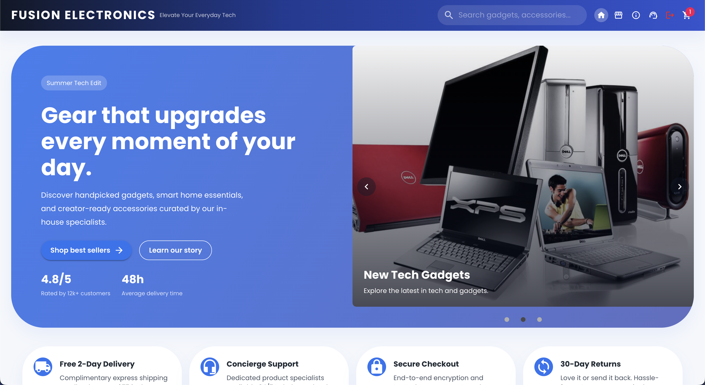
</p>

### Recommended Products (based on user interaction)

<p align="center">
    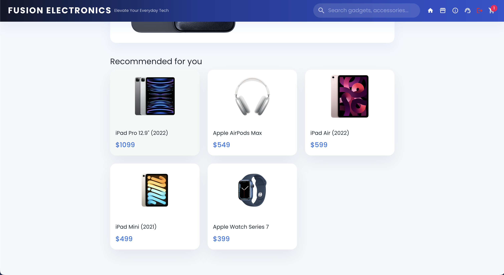
</p>

### Full Product List

<p align="center">
    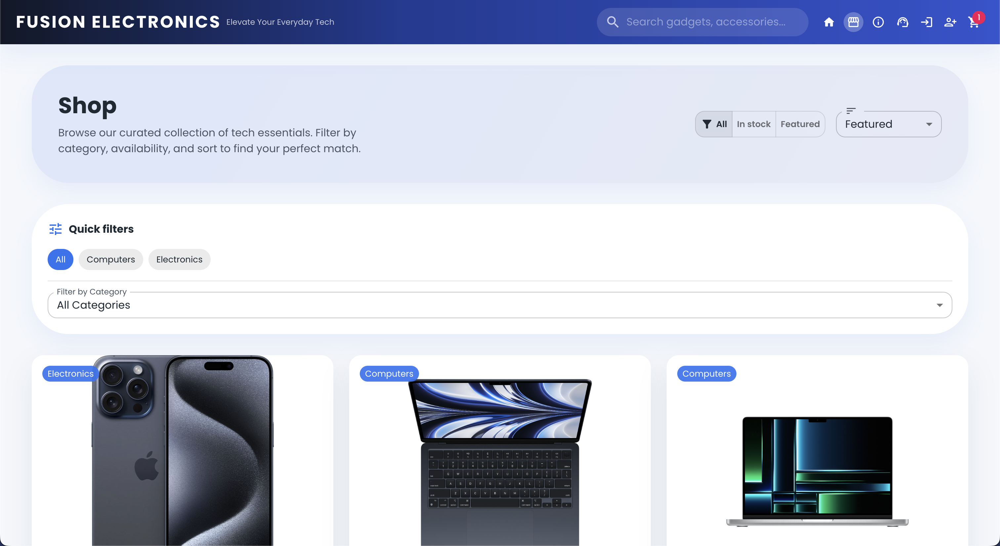
</p>

### Search Results

<p align="center">
    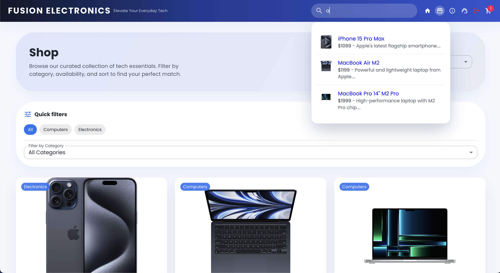
</p>

### Product Details Page

<p align="center">
    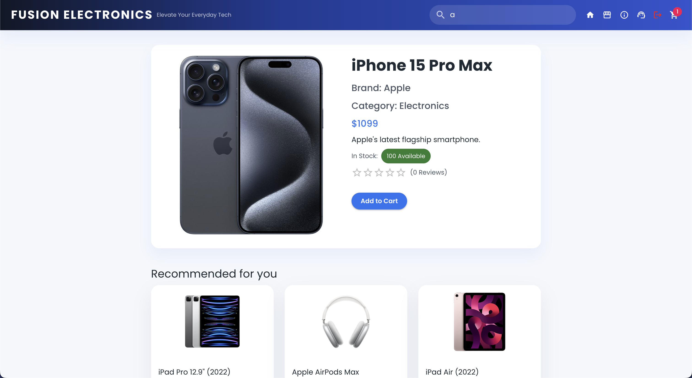
</p>

### Cart Page

<p align="center">
    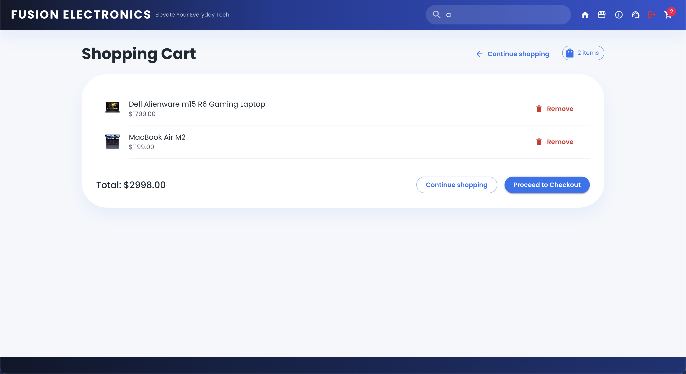
</p>

### Checkout Page

<p align="center">
    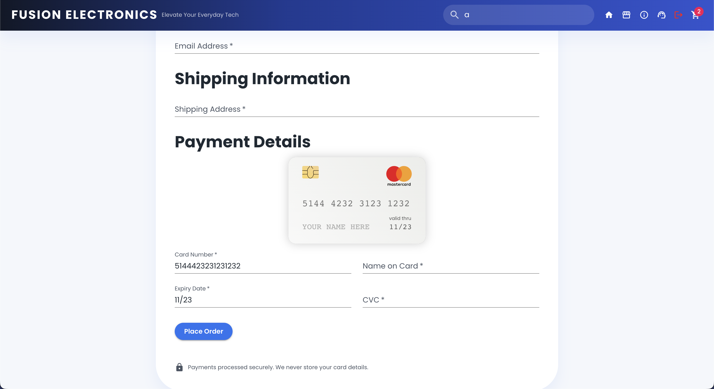
</p>

### Support Page

<p align="center">
    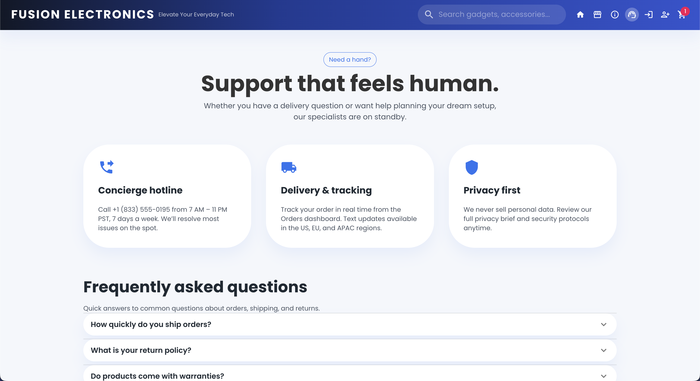
</p>

### About Page

<p align="center">
    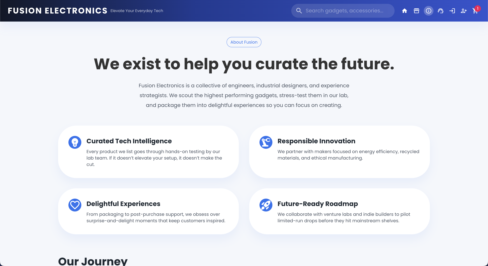
</p>

### Order Confirmation

<p align="center">
    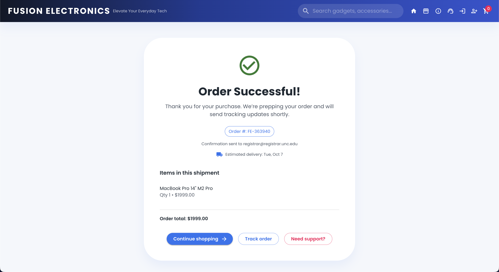
</p>

### Order Tracking

<p align="center">
    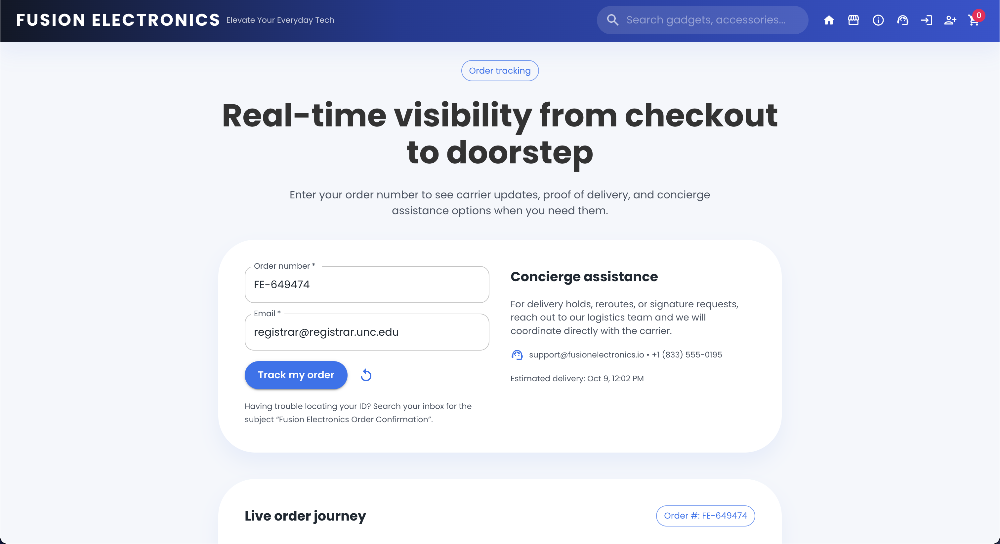
</p>

### Shipping & Returns

<p align="center">
    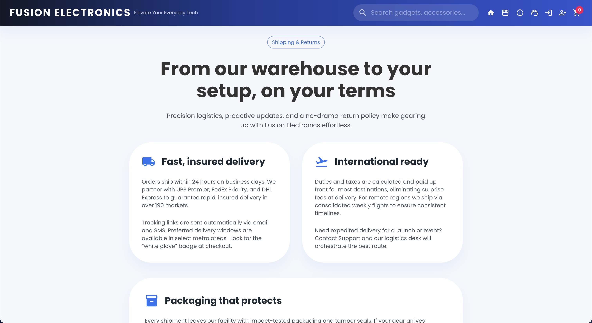
</p>

### Terms of Service

<p align="center">
    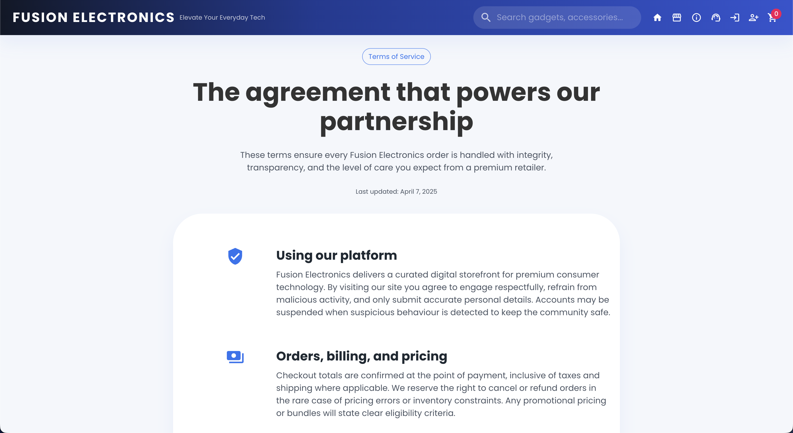
</p>

### Privacy Policy

<p align="center">
    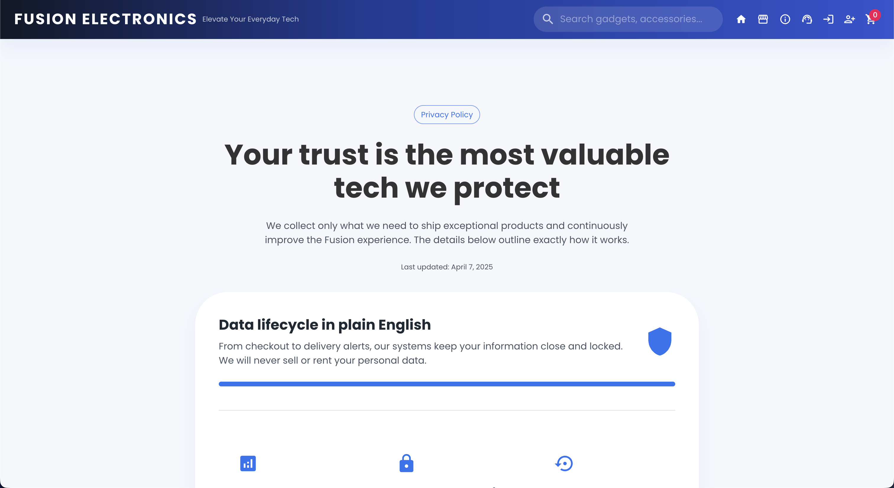
</p>

### Login Page

<p align="center">
    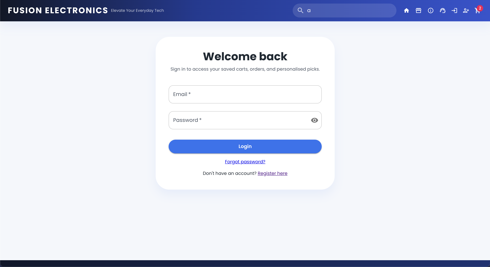
</p>

### Register Page

<p align="center">
    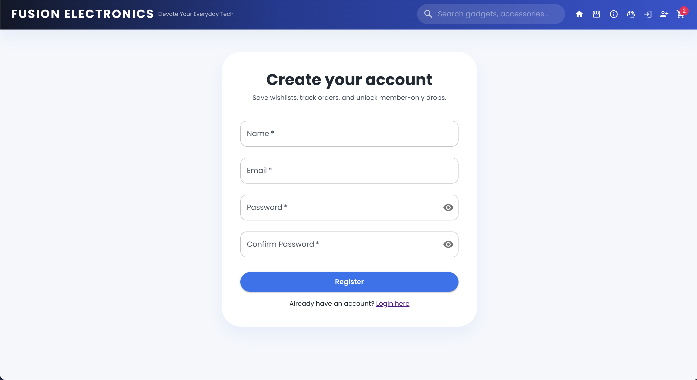
</p>

### Forgot Password Page

<p align="center">
    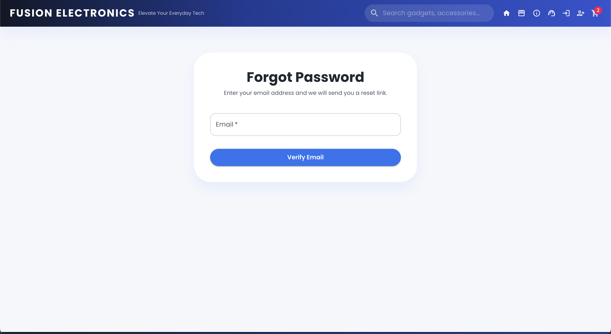
</p>

### Reset Password Page

<p align="center">
    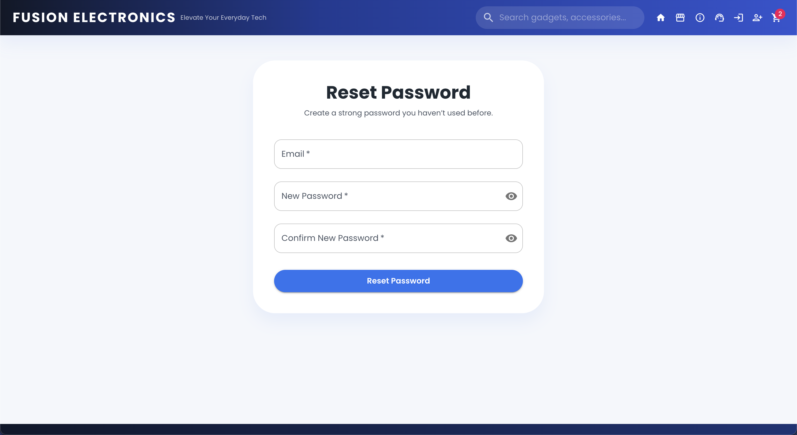
</p>

## Features

- **Product Management:**

  - View a list of products.
  - View detailed product information.
  - Add products to the shopping cart.

- **Shopping Cart:**

  - View items in the shopping cart.
  - Remove items from the cart.
  - Calculate total amount of items in the cart.

- **Checkout Process:**
  - Enter billing, shipping, and payment information.
  - **Client-side credit card validation:**
    - Luhn algorithm validation for card number verification
    - Automatic card type detection (Visa, Mastercard, Amex, Discover, Diners Club, JCB)
    - Real-time validation with visual error feedback
    - Expiry date validation (checks for valid month and ensures card hasn't expired)
    - CVC validation (3 digits for most cards, 4 for American Express)
    - Email format validation
  - Simulate the order creation process on the backend.
  - Receive confirmation of order success.

> [!TIP]
> When testing the checkout process, you can use the following test credit card number: `4242 4242 4242 4242` with any future expiry date and any CVC code. This is because we use Luhn algorithm validation for card number verification only, and no actual payment processing is done.

- **User Authentication:**

  - User registration and login.
  - Password hashing for security.
  - Protected routes for authenticated users.
  - JWT-based authentication.
  - Forgot and reset password functionality.
  - User profile management (view and update profile information).
  - Order history (view past orders).

- **Product Recommendations:**

  - Vector-based product recommendations using Pinecone (with optional Weaviate support).
  - Similar products displayed on product detail pages.

- **Search Functionality:**

  - Search products by name, description, brand, or category.
  - Real-time search suggestions.
  - Filter and sort search results.
  - Pagination for search results.
  - Debounced search input to optimize performance.

- **Order Tracking:**

  - View order status and details.
  - Get estimated delivery date and tracking information.

- **Terms of Service & Privacy Policy:**

  - Inform users about terms of service and privacy policy.

- **Support Page:**

  - Provide contact information and support resources.
  - FAQ section.
  - Contact form for user inquiries.

- **Responsive Design:**
  - Mobile-friendly layout.
  - Responsive components for various screen sizes.

## Technologies Used

- **Frontend:**

  - React.js
  - Material-UI for styling
  - Axios for API requests
  - `react-credit-cards-2` for credit card visualization
  - `react-router-dom` for routing
  - `react-hook-form` for form validation
  - `react-toastify` for toast notifications
  - Jest and React Testing Library for testing

- **Backend:**

  - Node.js
  - Express.js
  - MongoDB (with Mongoose ODM)
  - Axios for external API requests
  - JsonWebToken for user authentication
  - Bcrypt for password hashing
  - Dotenv for environment variables
  - Cors for cross-origin resource sharing
  - Swagger for API documentation
  - Nodemon for server hot-reloading
  - **Middleware**: JWT for securing API endpoints
  - **Pinecone** and **Weaviate** for product recommendations with vector databases

- **Development Tools:**
  - Jetbrains WebStorm (IDE)
  - Postman (for API testing)
  - Git (version control)
  - npm (package manager)
  - Docker (for containerization)
  - GitHub Actions (for CI/CD)
  - Vercel and Render (for deployment)

## Project Structure

The project is organized into two main "stacks": The backend is in the `backend` directory that hosts all product & order data and the frontend is in the `root` directory. Here is an overview of the project structure:

```
fullstack-ecommerce/
├── backend/                       # Node.js server files
│   ├── config/                    # Configuration files
│   │   └── db.js                  # Database connection
│   ├── docs/
│   │   └── swagger.js             # Swagger API documentation setup
│   ├── models/                    # Mongoose models
│   │   ├── user.js                # User schema
│   │   └── product.js             # Product schema
│   ├── routes/                    # Route handlers
│   │   ├── products.js            # Product routes
│   │   ├── search.js              # Search routes
│   │   └── checkout.js            # Checkout routes
│   ├── middleware/                # Middleware functions
│   │   ├── auth.js                # Authentication middleware
│   ├── scripts/                   # Scripts for various tasks
│   │   ├── build-faiss-index.js   # Script to build FAISS index
│   │   ├── search-faiss-index.js  # Script to search FAISS index
│   │   ├── query-weaviate.js      # Script to query Weaviate
│   ├── weaviateClient.js          # Weaviate client setup
│   ├── pineconeClient.js          # Pinecone client setup
│   ├── faiss.sh                   # FAISS index setup script
│   ├── .env                       # Environment variables
│   └── index.js                   # Server entry point
├── public/                        # Frontend public assets
│   ├── index.html                 # HTML template
│   ├── manifest.json              # Web app manifest
│   └── favicon.ico                # Favicon
├── src/                           # React.js frontend files
│   ├── components/                # Reusable components
│   │   ├── CheckoutForm.jsx       # Checkout form component
│   │   ├── ProductCard.jsx        # Product card component
│   │   ├── NavigationBar.jsx      # Navigation bar component
│   │   ├── OrderConfirmation.jsx  # Order confirmation component
│   │   ├── ProductListing.jsx     # Product listing component
│   │   ├── SearchResults.jsx      # Search results component
│   │   └── ShoppingCart.jsx       # Shopping cart component
│   ├── dev/                       # Development utilities
│   │   ├── index.js               # Development entry point
│   │   ├── palette.jsx            # Color palette
│   │   ├── preview.jsx            # Component preview
│   │   └── useInitials.js         # Initials hook
│   ├── pages/                     # Page components
│   │   ├── Cart.jsx               # Cart page component
│   │   ├── Checkout.jsx           # Checkout page component
│   │   ├── Home.jsx               # Home page component
│   │   ├── ProductDetails.jsx     # Product details page component
│   │   ├── OrderSuccess.jsx       # Order success page component
│   │   ├── ProductDetails.jsx     # Product details page component
│   │   └── Shop.jsx               # Shop page component
│   ├── App.jsx                    # Main application component
│   ├── App.css                    # Main application styles
│   └── index.js                   # React entry point
├── build/                         # Frontend production build files
├── tests/                         # Test files
├── .gitignore                     # Git ignore file
├── package.json                   # NPM package file

```
